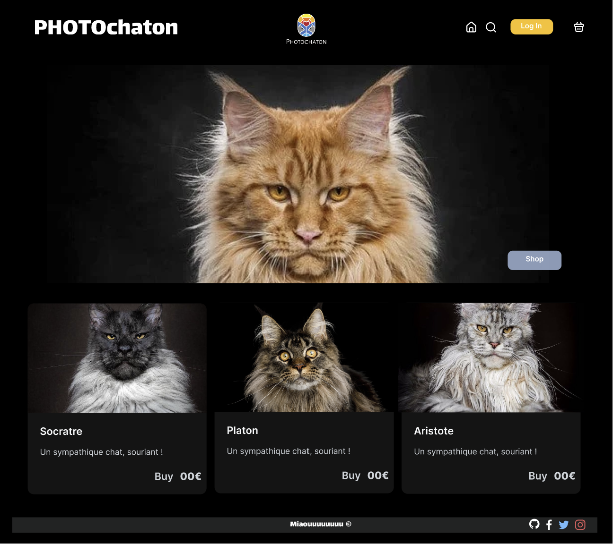
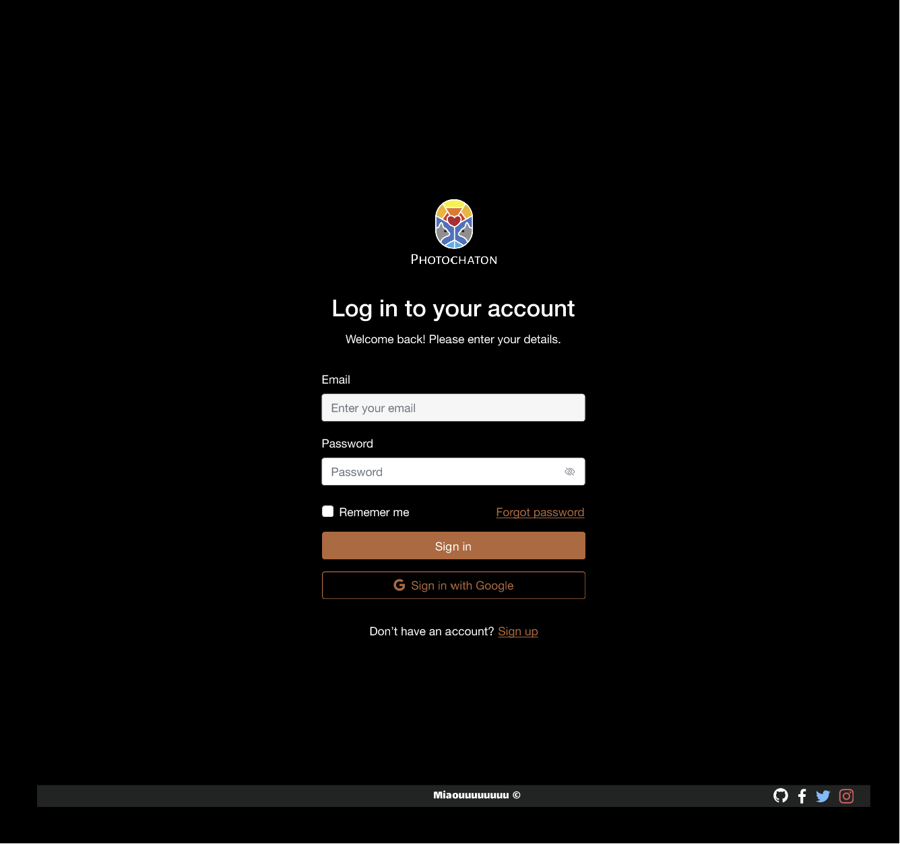
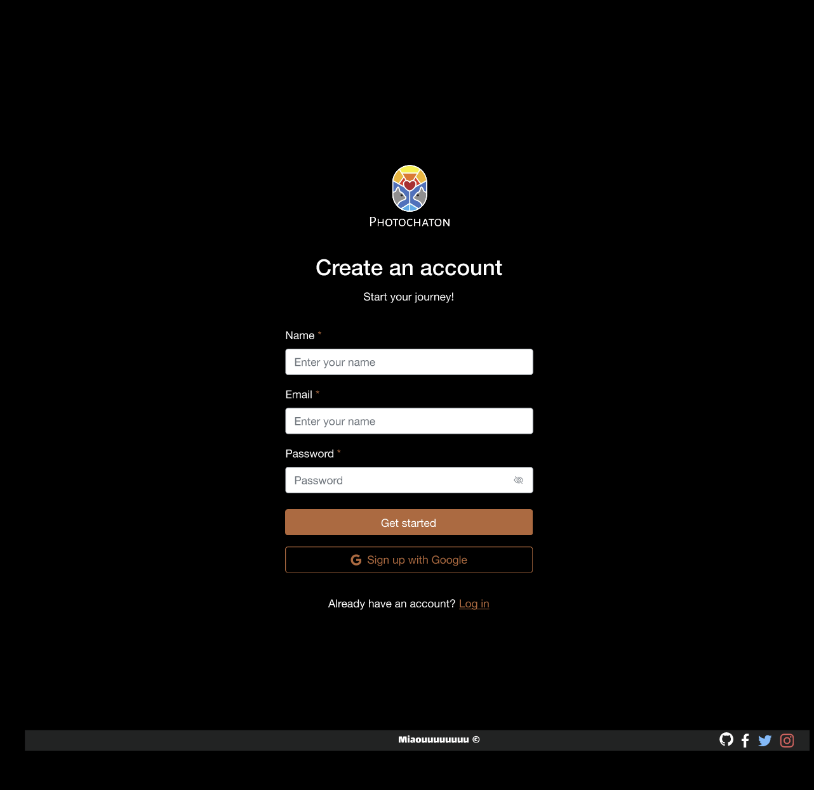
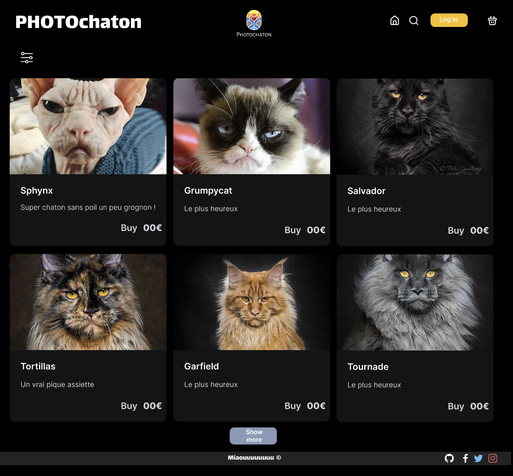
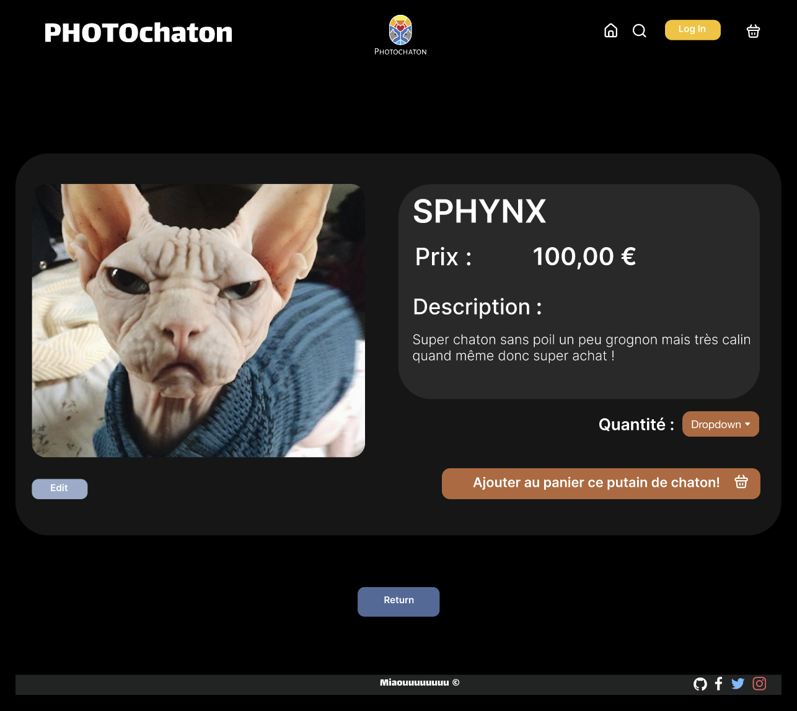
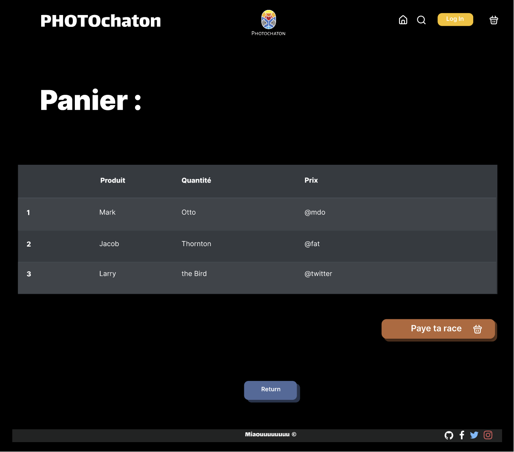

# Maquette Figma de la boutique de chatons

Voici la maquette Figma de notre projet Photochaton, merci à Grégory Magnat et la team Arabicode!

## Aperçu de la maquette 

## Lien pour la consulter 

https://www.figma.com/file/5b3b1PHcctALa14P38zHVg/Boutique-Chaton